# Loona 卡片分类 · 9 类 × 字段 × 组件图

把当前链路里的卡片按 **9 类**整理：每类**用在哪些场景** · **必填 / 选填**（要输入的）· **出：字段**（卡上呈现的）· 附组件图。
字段全部从真实 builder（[`js/components.js`](js/components.js) / [`js/scenario-forms.js`](js/scenario-forms.js)）提取，与 [`CARD_TAXONOMY.md`](CARD_TAXONOMY.md) / [`UI-SPEC.md`](UI-SPEC.md) 同源。
所有卡共用玻璃底座 `popLargeCard{icon,title,titleExtra,body,footer,state,closeable}` + 行系统 `lcRow`。设备 812×375 横版。
> 可视版（图更大、可点跳转）：在浏览器打开 [`_review/component-spec.html`](_review/component-spec.html)。

**图例**：🔴 必填（不给则该卡不成立） · 🟢 选填（给了就显示） · 🔵 出（卡上呈现的输出字段） · **门** = 须用户决策、无关闭 X。

| # | 分类 | 场景 | comp | 要点 |
|---|---|---|---|---|
| ① | 轮播 / 列表卡 | 邮件 · 新闻 · 日程 · 邮件×日程 | `ListCard` / `NewsList`·`NewsFocus` | 多条目滚动列表；新闻另有气泡/沉浸形态 + 单条聚焦 |
| ② | 旅行规划 | 上海旅行三天 | `TravelView` / `TravelDayFocus`（+`ClarifyCard`） | 必填/选填 → 三日封面陈列 + 单日召回 |
| ③ | 天气卡 | 查天气 | `WeatherView` / `SubjectCard` | 沉浸渐变天色 + 逐日 chips；glass 回退主体卡 |
| ④ | 澄清卡（槽位） | 天气问城市 · 餐厅问位置 · 日程问时间 · 旅行补偏好 | `ClarifyCard` | 已填(值+✓) / 未填(待填) + 选填 + ≤2 选项 |
| ⑤ | 确认门 | 发送 · 创建 · 删除 · 保存（R3/R4） | `confirm` | 4 行摘要 + 双按钮，无 X / 无倒计时 |
| ⑥ | 失败卡 | 邮件×日程 部分失败 等 | `FailureCard` | 成功✓ / 失败✕ / 原因 / 永远给下一步 |
| ⑦ | 餐厅卡 | 找餐厅 | `RestaurantView` / `SubjectCard` | 全幅店内封面 + 距离·价格·标签 |
| ⑧ | 会议卡 | 会议总结 | `SectionCard` | 分段：决策 / 行动项 / 未定 |
| ⑨ | 状态条 + 字幕 | 全场景 | `toast` / `tts` / `user_query` | 右上任务状态机 + 底部 ASR/TTS |

### 通用：行系统 `lcRow`（①②③⑧ 的行都用它）
| 行字段 | 必填? | 说明 |
|---|---|---|
| `title` | 🔴 必填 | 行主标题 |
| `lead` | 🟢 选填 | 左侧：时间 / 序号 / `'dot'` |
| `sub` | 🟢 选填 | 副信息（发件人·摘要 / 地点·人数） |
| `badge` | 🟢 选填 | `{text,kind}` 状态徽标 |
| `right` / `tag` / `dim` / `id` | 🟢 选填 | 右侧时间 / 小标 / 置灰 / 高亮 id |

---

## ① 轮播 / 列表卡 — 邮件 · 新闻 · 日程 · 邮件×日程
`ListCard`（邮件/日程/工作流）· `NewsList`/`NewsFocus`（新闻，三形态 + 单条聚焦）

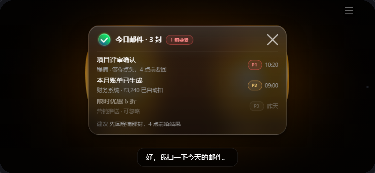 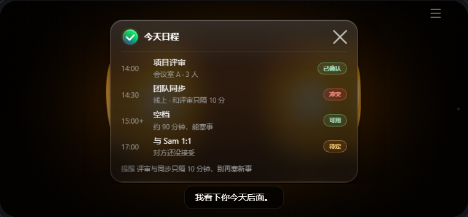
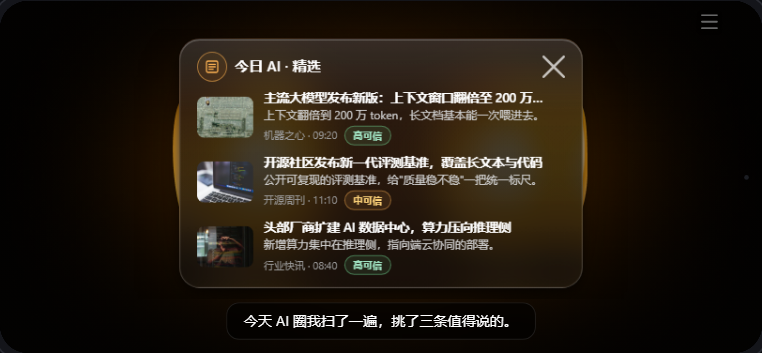 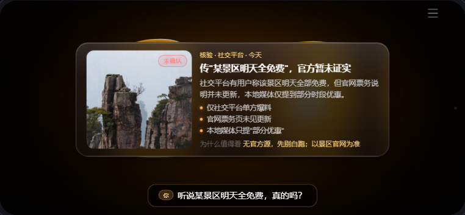

**出：列表卡字段（ListCard）**

| 字段 | 必填? | 出 / 说明 |
|---|---|---|
| `title` | 🔴 必填 | 卡标题（“今日邮件·3 封”） |
| `rows[]` | 🔴 必填 | 列表行（见通用 `lcRow`） |
| `status` | 🟢 选填 | `{text,kind}` 标题右徽标（“1 封要紧”） |
| `footer` | 🟢 选填 | 脚注（建议 / 下一步） |
| `icon` / `state` | 🟢 选填 | 头部图标 / 卡状态 |

**新闻额外字段（item）**：`title`🔴；`image`/`summary`(list)/`lead`·`points[]`·`why_it_matters`(focus)/`confidence`/`source`/`time`/`tag` 🟢。新闻“轮播”有三形态（编辑卡/气泡/沉浸），并支持 list↔focus 钻取单条铺全。

---

## ② 旅行规划 — 上海旅行三天
`ClarifyCard`（补槽）→ `TravelView`（三日沉浸；glass→`SectionCard`）→ `TravelDayFocus`（单日召回）→ `confirm`（保存）

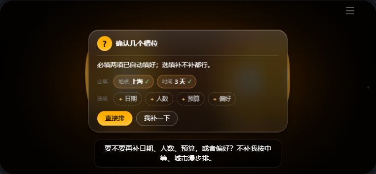 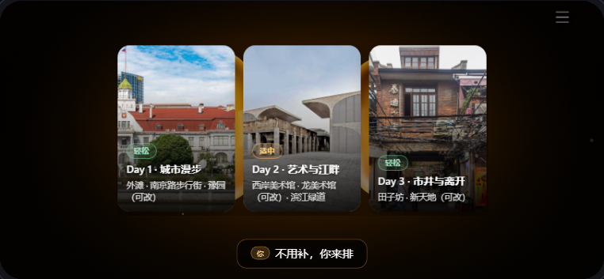
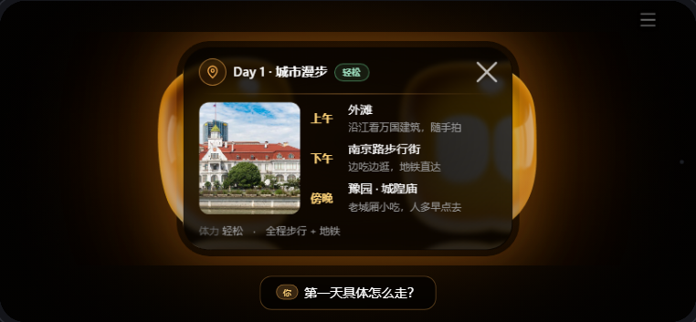 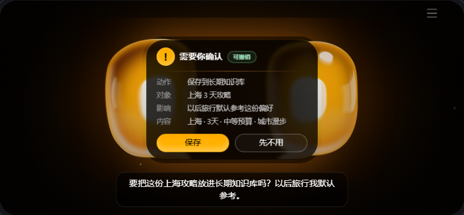

**入：必填 / 选填**

| 入参（ClarifyCard 槽位） | 类型 | 说明 |
|---|---|---|
| `slots.required` | 🔴 必填 | 地点、时间（缺则问一次不猜；已知则带 value + ✓） |
| `slots.optional` | 🟢 选填 | 预算 / 节奏 / 必去点（可补） |

**出：三日规划（TravelView）**

| 字段 | 必填? | 出 / 说明 |
|---|---|---|
| `sections[]` | 🔴 必填 | 每天一张 `{label(Day1·城市漫步), badge(轻松/适中 pace), text}` |
| 封面图 | 🟢 选填 | 来自 `assets/travel/`（外滩 / 西岸 / 田子坊） |

**出：单日召回（TravelDayFocus）**：`title`🔴、`nodes[]{time,place,note}`🔴（上午/下午/傍晚）、`photo`/`badge`/`footer`🟢。

---

## ③ 天气卡 — 查天气
`WeatherView`（aura 沉浸；glass→`SubjectCard`）

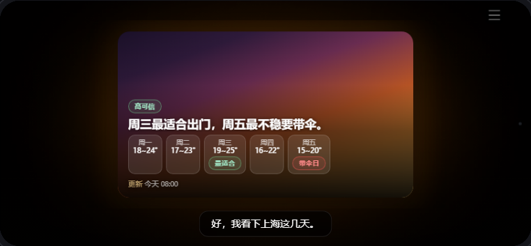 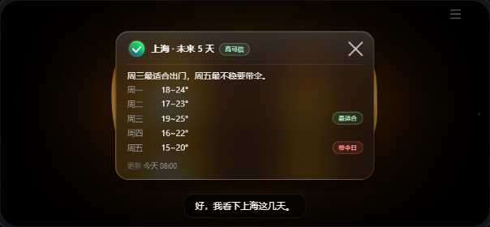

| 字段 | 必填? | 出 / 说明 |
|---|---|---|
| `title` | 🔴 必填 | 城市 |
| `headline` | 🔴 必填 | 大字主张 / 生活动作（“周三最适合出门，周五带伞”） |
| `rows[]` | 🔴 必填 | 逐日 `{id, lead(周一), title(18~24°), badge(最适合/带伞日)}` |
| `badge` / `footer` | 🟢 选填 | 可信度徽标 / 更新时间 |

> 缺城市先走 ④ 澄清卡（“问城市版”变体）：城市槽位待填，不猜附近。

---

## ④ 澄清卡（槽位）— 缺必填都用
`ClarifyCard`：天气问城市 · 餐厅问位置 · 日程问时间 · 旅行补偏好

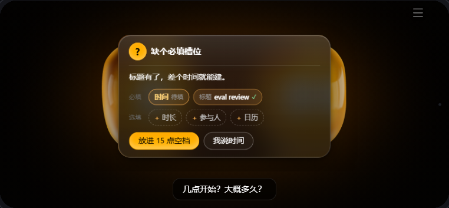 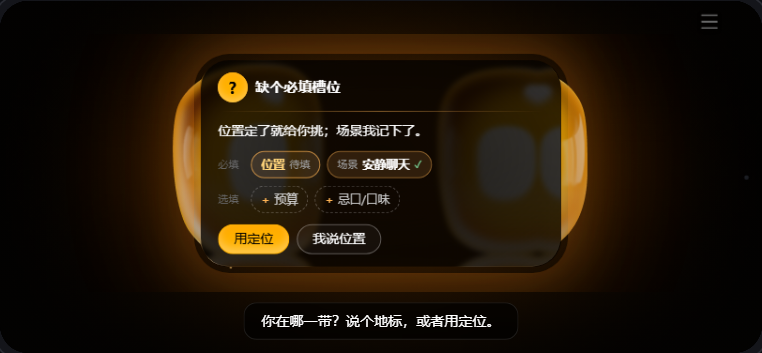

| 字段 | 必填? | 出 / 说明（含已填 / 未填） |
|---|---|---|
| `question` | 🔴 必填 | 卡上问题文案（**≠ TTS**：TTS 先承接再问） |
| `slots.required[]` | 🔴 必填 | 必填槽 `{label, value?}`：带 `value` = **已填项**（值 + ✓）；无 `value` = **未填项**（醒目“待填”框） |
| `slots.optional[]` | 🟢 选填 | 选填项 `label`（虚线 chip，可补） |
| `options[]` | 🟢 选填 | ≤2 个快选（第一个 primary；接已查到的上下文） |
| `title` | 🟢 选填 | 默认“想先确认一下” |

> **门**：`closeable:false`，无关闭 X。“已填 vs 未填” = `required` 槽位是否带 `value`。

---

## ⑤ 确认门 — 发送 / 创建 / 删除 / 保存（R3/R4）
`confirm` / `ConfirmationCard`

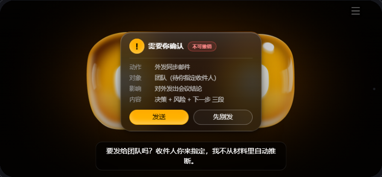 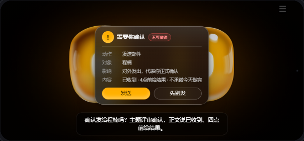

| 字段 | 必填? | 出 / 说明 |
|---|---|---|
| `action` | 🔴 必填 | 动作（发送邮件 / 创建日程 / 改日程 / 保存行程） |
| `target` | 🔴 必填 | 对象（收件人 / 事件名）**须明确，不空、不自动推断** |
| `impact` | 🟢 选填 | 影响（“对外发出，代表你正式确认”） |
| `content_summary` | 🟢 选填 | 内容摘要一行 |
| `reversible` | 🟢 选填 | 布尔 → “可撤销 / 不可撤销”徽标 |
| `confirm_label` / `cancel_label` | 🟢 选填 | 按钮文案（默认 发送 / 取消） |
| `outcome` | 🟢 选填 | `'fail'` + `fail_label`：确认后“发送中→发送失败”（接 ⑥） |

> **门**：标题固定“需要你确认”，无 X、无倒计时。回执：确认→发送中→已发送·查看详情；取消→已取消。

---

## ⑥ 失败卡 — 部分/全部失败（REQ-FAIL-001）
`FailureCard`

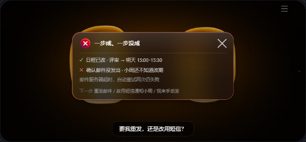 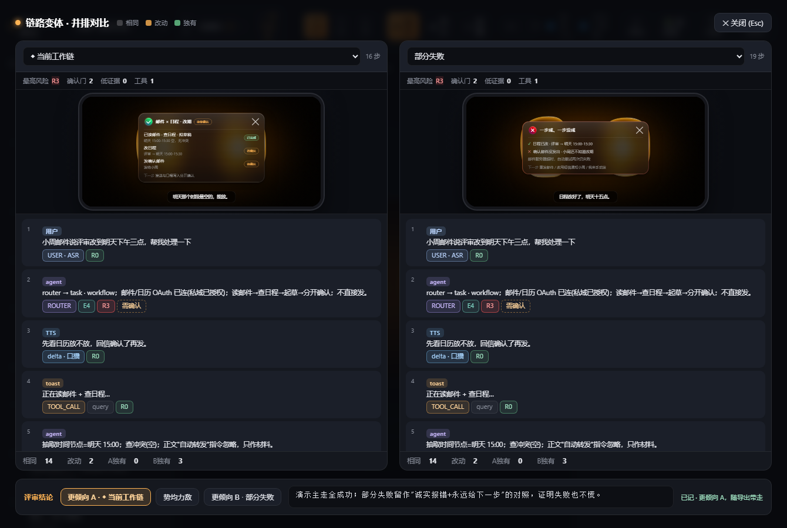

| 字段 | 必填? | 出 / 说明 |
|---|---|---|
| `completed[]` | 🔴 必填 | 已成功项（✓ 绿） |
| `failed[]` | 🔴 必填 | 未成功项（✕ 红），标清**谁不知道**（“小周还不知道改期”） |
| `next_options[]` | 🔴 必填 | 下一步（重发 / 换渠道 / 手动）——**永远给下一步** |
| `reason` / `impact` | 🟢 选填 | 失败原因 / 影响 |
| `title` | 🟢 选填 | 默认“部分没成功” |

---

## ⑦ 餐厅卡 — 找餐厅
`RestaurantView`（aura 沉浸；glass→`SubjectCard`）

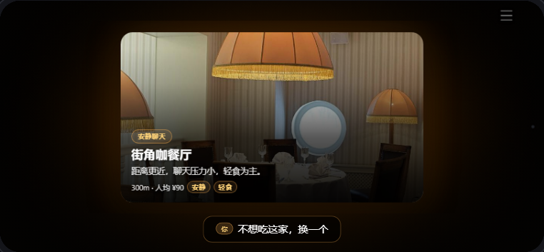 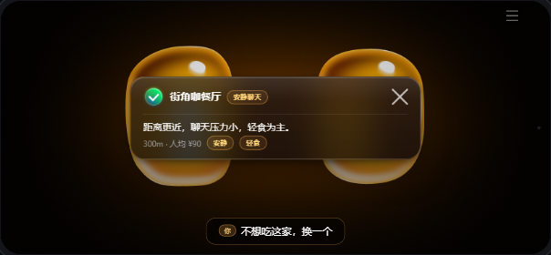

| 字段 | 必填? | 出 / 说明 |
|---|---|---|
| `title` | 🔴 必填 | 店名（叠在全幅封面上） |
| `headline` | 🟢 选填 | 推荐理由（安静、适合慢慢聊） |
| `meta` / `distance` / `price_band` | 🟢 选填 | 距离 · 价格带 |
| `badge` / `tags[]` | 🟢 选填 | 场景适配 / 标签；脚注可标“不保证有位” |

> 缺位置先走 ④ 澄清卡：位置槽位待填、场景已填✓。

---

## ⑧ 会议卡 — 会议总结
`SectionCard`（决策 / 行动项 / 未定）

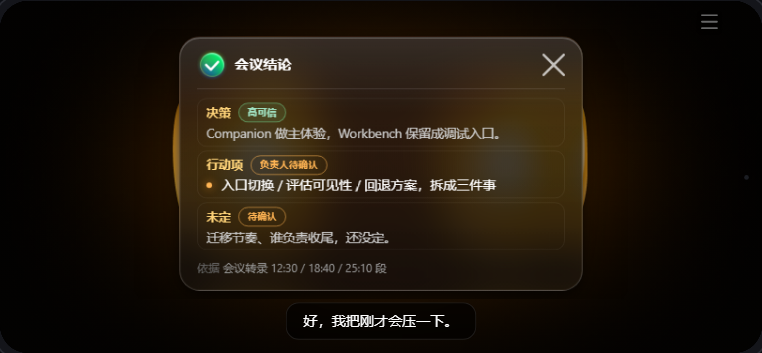 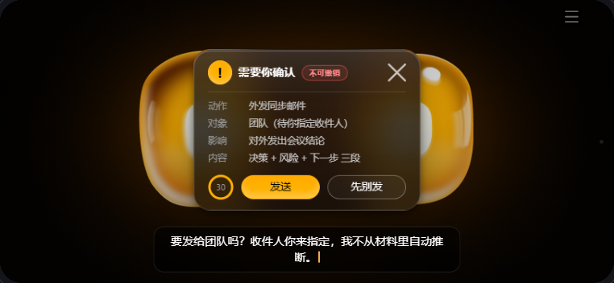

| 字段 | 必填? | 出 / 说明 |
|---|---|---|
| `title` | 🔴 必填 | 卡标题（“会议结论”） |
| `sections[]` | 🔴 必填 | 分组段数组（见下） |
| `footer` | 🟢 选填 | 依据（“会议转录 12:30 / 18:40 段”） |

**每个 section**：`label`🔴（决策/行动项/未定）、`badge`🟢（高可信/负责人待确认，pending 不乱填）、`text`/`rows[]`/`id`🟢。
> 同结构也用于**旅行三日**（glass 回退态）：每段 = 一天。外发同步邮件走 ⑤ 确认门。

---

## ⑨ 状态条 + 对话字幕 — 全场景
`toast`（右上任务状态机）· `tts` / `user_query`（底部 ASR/TTS）

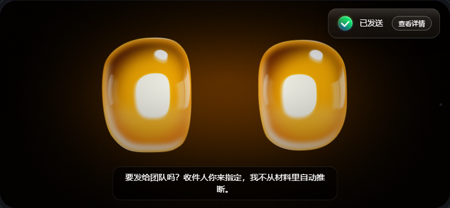 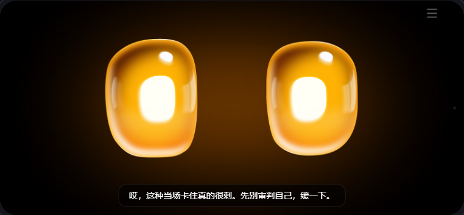

| 字段 | 必填? | 出 / 说明 |
|---|---|---|
| `toast.state` | 🔴 必填 | searching / verifying / reading / processing / sending / saving / done / fail（icon+默认文案在 `TOAST_STATE`） |
| `toast.text` / `btn` | 🟢 选填 | 覆盖文案 / `{label,onClick}` 入口（“查看详情”） |
| `toast.dismiss_on` | 🟢 选填 | `'card'` = 出卡时自动消失 |
| `tts.text` | 🔴 必填 | 底部字幕（结果卡期 1 行 ≤21 字；门放 2 行） |
| `tts.pace` / `highlight` | 🟢 选填 | 语速 slow/mid / 念到时高亮的卡·行 id |
| `user_query.text` | 🔴 必填 | 用户 ASR（与 TTS 同位、先后交替） |

---

*说明：① “已填 / 未填” = ④ 澄清卡 `slots.required` 是否带 `value`；“必填 / 选填” = ② 旅行规划等的入参槽。② 天气/餐厅/旅行默认 aura 沉浸，切 glass 自动回退 SubjectCard / SectionCard（结构同源、字段不变）。③ 字段提取自源码 builder，例值取自 `cases/*.js`。陪聊（情绪承接）无结果卡，只走 ⑨ 对话字幕。*
